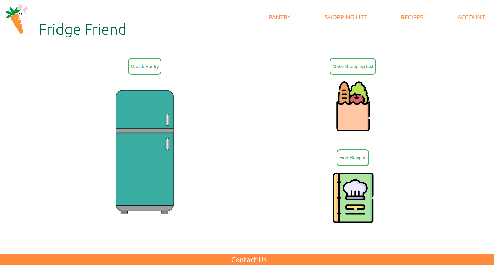

# Fridge Friend
Created by: Kara Wolley, Saloni Sharma, Patrick Conley

## Overview

App: [Source Code](https://github.com/s-saloni/FridgeFriend/tree/master/HerokuApp) and [Demo](https://fridge--friend.herokuapp.com/)

Testing: [Recipes](https://github.com/s-saloni/FridgeFriend/blob/master/Match%20Ingredients%20to%20Recipes/MatchRecipes_Test.py), [Pantry](https://github.com/s-saloni/FridgeFriend/blob/master/Inventory/pantry_test.py), [User Acceptance Testing](https://github.com/s-saloni/Fridge-Friend/blob/master/TESTING.md)

Presentation Materials: [Slides](https://docs.google.com/presentation/d/1RHDGq7ogDPU8POB_Kty0tTg1hHZtAHaKqQQC5kaXBNE/edit?usp=sharing)

## Vision Statement
This novel app will help reduce food waste and decrease time associated with frequent planning for grocery shopping. It will provide grocery planning based on weekly meal plans and items already stored in the kitchen. Through tracking expiration dates and recommended use by times for produce, this app will allow users to spend more time enjoying their food than worrying about when their next grocery trip needs to be.

## Motivations
By creating an ease of use, time reduction, make-life-easier app, busy individuals can routinely relish food from an optimally stocked pantry as well as make healthier choices through improved planning ability.

## Risks to project completion
Overall, as we have no experience building web-based applications, there is a need for various new skills to be learned. There is new programming language experience required for the development of this app (HTML, CSS, Javascript, SQL, et al). Furthermore, time management and scheduling between teammates in different time zones and outside normal working hours will be challenging. Little guidance in the development of the program may reduce focus in key areas. 

## Mitigation Strategy for above risks
For questions related to programming tools and methods, attending office hours will allow us to clarify any questions. Online resources for tutorials and examples of new frameworks will be very beneficial in learning new material. Also, we will utilize frequent communication (email, slack, github, zoom) to manage work so that all team members are up to date on tasks and progress of the project.

## Development method: scrum, kanban, waterfall:
The scrum development method will be used.  We will build based on the user story with the understanding that the project will be continuously evolved. As features are added, a sprint will be organized by the scrum master to attempt to address new feature implementations. We will organize scrum meetings and create a burndown chart to ensure progress is being reached by the milestone deadlines.

## Project Tracking Software 
We plan to use GitHub tools for the "tracking software," such as by creating checklists for tasks. We feel that the assigment can be accomplished with the use of this simple technique to track project milestones and assign duties to team members. Also, branches with associated documentation can provide a holistic view of the target goals for the application. After early development, if further specific tools show beneficial uses, not available in github, to manage the project scope, then additional options, such as Trello, may be implemented in the completion on this project.

